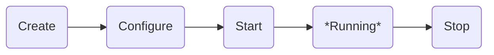

# ADR: Core, Plugins, and Extensions

## 1. Context

ArxHub uses a modular design. It helps us:

- Change features easily as users need them.
- Let the community help build the platform.

## 2. Decision

ArxHub organize the system this way:

### Core

The core manage plugin lifecycle. Provides basic services: `logging`. The core doesn't add features itself, but it gives other parts a place to work.

### Plugins

A plugin adds a new feature. It can work on its own. Plugins can create extensions.

#### Responsibilities:

- Adds a new feature.
- Can be turned on or off.
- Can have extensions to tweak how plugin works.

#### Plugin Lifecycle

Plugins go through these stages:

1.  **Create:** The `create` method is called. Plugin should create extensions.
2.  **Configure:** The `apply` method is called. All plugins are created. Plugins can intersact each other.
3.  **Start:** The `start` method is called to begin long-running tasks like serving a http server.
4.  **Running:** The plugin is running and doing its job.
5.  **Stop:** The `stop` method is called to stop any long-running tasks and clean up.

Here's a diagram of the plugin lifecycle:

### Extensions

An extension is a public plugin api.

#### Responsibilities:

- Lets you configure a plugin.
- Users can set options in config files or a UI.

Example:

- A rate-limiting extension for the `http-server` plugin limits how many requests the server handles to prevent attacks.
- An authentication extension for the `http-server` plugin requires users to log in.
- A theme extension for the `gateway-html` plugin changes the look of the website.
