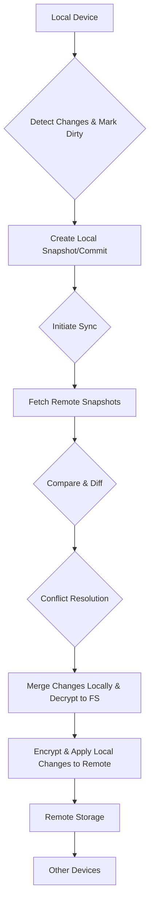

# SyncEngine Technical Design Document

## 1. Introduction
- Purpose of the SyncEngine.
- High-level overview of "git-like" synchronization for notes.
- Goals: Offline-first, E2E encryption, efficient, conflict resolution.

## 2. System Architecture
- Overview of components: Local File System (for decrypted notes), Remote Storage, Sync Engine Core.
- Interaction with other ArxHub components (e.g., VFS, Core).
- Diagram: High-level component diagram.

```mermaid
graph TD
    A[Note-Taking App] -->|Uses| B[SyncEngine]
    B --> C[Local File System (Decrypted Notes)]
    B --> D[Remote Storage (e.g., S3, custom cloud)]
    B --> E[Encryption Module]
    C --> F[Note Files]
    D --> G[Encrypted Note Chunks]
    E --> B
```

## 3. Data Structures
- **Note Representation:** How individual notes are structured (ID, content, metadata, version).
- **Version History:** How changes are tracked (e.g., content-addressable storage, Merkle tree concepts).
- **Local File System Structure:** How decrypted notes are stored on the local file system.
- **Dirty File Tracking:** Mechanism to identify files modified locally that need synchronization (e.g., a separate manifest file, file system watchers, or a simple dirty flag).
- **Remote Storage Format:** How encrypted data is stored remotely (e.g., chunks, manifests).

## 4. Synchronization Strategy (Git-like)
- **Core Concepts:**
    - **Commits/Snapshots:** How changes are grouped and versioned.
    - **Branches (Implicit):** How different device states are managed.
    - **Diffing & Patching:** How changes are identified and applied.
- **Workflow:**
    1.  **Local Changes:** How local edits are recorded and marked as "dirty."
    2.  **Pull (Fetch & Merge):**
        -   Downloading remote changes.
        -   Identifying divergences.
        -   Merging strategies.
        -   Decryption and writing to local file system.
    3.  **Push (Upload):**
        -   Identifying "dirty" local files.
        -   Encrypting and uploading local changes.
        -   Handling remote updates during push.
- **Diagram:** Synchronization workflow.



## 5. Conflict Resolution
- **Detection:** How conflicts are identified (e.g., divergent histories, same file modified).
- **Strategies:**
    -   Last-write wins (simple, default).
    -   Three-way merge (more advanced, requires content understanding).
    -   User intervention (if automatic merge fails).
- **Implementation Details:** How merge algorithms would work.

## 6. Encryption
- **End-to-End Encryption (E2E):** Reinforce the E2E principle.
- **Key Management:** How encryption keys are generated, stored, and used (never leaves device).
- **Encryption Algorithm:** AES-256-GCM.
- **Data Flow:** Where encryption/decryption occurs in the sync process (before writing to remote, after reading from remote).

## 7. Implementation Approach
- **Core Modules:**
    -   `engine.ts`: Orchestrates sync process.
    -   `local-file-system-manager.ts`: Interface for local file system interactions and dirty file tracking.
    -   `remote-storage.ts`: Interface for cloud storage interactions (e.g., `cloud/s3.ts`).
    -   `crypto.ts`: Encryption/decryption utilities.
    -   `diff-merge.ts`: Logic for diffing and merging.
- **Dependencies:** Highlight `@arxhub/stdlib` and `@arxhub/vfs` if applicable.
- **Error Handling:** Strategies for network issues, data corruption, etc.

## 8. Future Considerations
- Support for multiple remote backends.